<div align="center">
  
</div>

<p align="center">
  <a href="https://github.com/JimMinseay3?tab=repositories"></a>
  
  
</p>

## `hello, world`

I'm **POCO**, a software builder based in Shenzhen. I turn ambiguous ideas into working systems — from architecture and APIs to interfaces, automation, testing, and delivery.

I care about software that is **useful, understandable, and reliable**. My projects move across different domains; the constant is the engineering: clear boundaries, observable behavior, safe failure modes, and an experience people can actually use.

## Engineering focus

| | What I build | How I think about it |
|---|---|---|
| **AI systems** | Agent workflows, retrieval, structured outputs, tool use | Evidence, guardrails, human review, deterministic fallbacks |
| **Full-stack products** | APIs, web applications, desktop tools, dashboards | One coherent path from data model to user experience |
| **Data & automation** | Processing pipelines, reporting, task automation | Repeatable operations, audit trails, explicit state |
| **Engineering systems** | Tests, CI workflows, modular services, integrations | Maintainability and verification before complexity |

## Selected builds

<table>
  <tr>
    <td width="50%" valign="top">
      <h3><a href="https://github.com/JimMinseay3/crowdlaunch-ai">crowdlaunch-ai</a></h3>
      <p>An AI workspace built around multi-step research, diagnosis, evidence, and human approval workflows.</p>
      <p><code>TypeScript</code> <code>AI Agents</code> <code>Workflow Design</code></p>
    </td>
    <td width="50%" valign="top">
      <h3><a href="https://github.com/JimMinseay3/ApiKeyper">ApiKeyper</a></h3>
      <p>A local-first API key manager spanning a desktop application and browser extension.</p>
      <p><code>TypeScript</code> <code>Local-first</code> <code>Developer Tools</code></p>
    </td>
  </tr>
  <tr>
    <td width="50%" valign="top">
      <h3><a href="https://github.com/JimMinseay3/nexus-commerce-os">nexus-commerce-os</a></h3>
      <p>A full-stack operations platform with analytics, background jobs, and connector-oriented architecture.</p>
      <p><code>Python</code> <code>Django</code> <code>React</code> <code>PostgreSQL</code></p>
    </td>
    <td width="50%" valign="top">
      <h3><a href="https://github.com/JimMinseay3/crossborder-review-insight-agent">Agent Systems Lab</a></h3>
      <p>Six independently runnable experiments in explainable agents, auditable execution, and safe automation.</p>
      <p><code>FastAPI</code> <code>SQLite</code> <code>LLM</code> <code>Human-in-the-loop</code></p>
    </td>
  </tr>
</table>

## Toolbox

<p>
  
  
  
  
  
  
  
  
  
  
  
  
</p>

## Current exploration

```text
agentic workflows    ███████████████████░   building
local-first tools    ███████████████░░░░░   exploring
knowledge systems    ██████████████░░░░░░   learning
dev automation       █████████████████░░░   shipping
```

## GitHub signal

<div align="center">
  
</div>

<picture>
  <source media="(prefers-color-scheme: dark)" srcset="https://raw.githubusercontent.com/JimMinseay3/JimMinseay3/output/github-contribution-grid-snake-dark.svg" />
  <source media="(prefers-color-scheme: light)" srcset="https://raw.githubusercontent.com/JimMinseay3/JimMinseay3/output/github-contribution-grid-snake.svg" />
  
</picture>

<div align="center">
  <sub><code>build clearly · ship reliably · stay curious</code></sub>
</div>
